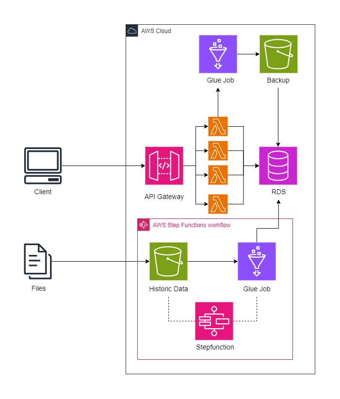

# InteligentHR
## API de Consultas SQL con Flask y PostgreSQL

Este proyecto es una API RESTful desarrollada con **Flask** que proporciona endpoints para interactuar con una base de datos **PostgreSQL**. Las consultas están separadas en archivos `.sql` y son ejecutadas dinámicamente en función de las solicitudes HTTP.

## Funcionalidades
La API ofrece cinco endpoints principales para ejecutar consultas SQL predefinidas:

1. **`/upload`**: Permite cargar datos en la base de datos a traves de una solicitud tipo post.
2. **`/backup/<table_name>`**: Realiza el backup de una tabla.
3. **`/restore/<table_name>`**: Restaura la información de la tabla.
4. **`/employee_counts`**: Obtiene el conteo de empleados por trimestre para el año 2021, segmentado por departamento y puesto de trabajo.
5. **`/departments_most_hired`**: Obtiene los departamentos con más empleados contratados en el año 2021, comparando el número de empleados contratados en cada departamento con un promedio calculado.

También cuenta con un módulo para realizar la migración hacia la base de datos de archivos en formato .csv

## Estructura del Proyecto

La estructura del proyecto es la siguiente:
INTELIGENTHR
|
│   ├──app/ 
│       ├── app.py # El archivo principal de la API
│       ├── backup.py # Funciones para crear el backup  
│       ├── db_and_models.py # Contiene la declaración del modelo de datos
│       ├── migrate.py # Modulo para migración de datos
│       ├── query_helper.py # Funciones para leer y ejecutar las consultas SQL
│       ├── restore.py # Funciones para restaurar el backup
│       └── utils.py # Funciones auxiliares
│   ├──assets/
│       ├── employee_generator.py # Script auxiliar para generación de empleados
│       └── intelligent_hr_data_model.png # Modelo de datos   
│   ├──data/
│       ├──backup/ # Carpeta para almacenar los backup
│       ├──config/
│           ├── config.json # Archivo con la configuración de la base de datos
│       ├──historic_data/ # Carpeta para almacenar archivos históricos
│       ├──logs/ # Carpeta para almacenar los logs   
│       └── queries/ # Carpeta que contiene los archivos SQL para hacer las solicitudes a la base de datos 
│       ├── employee_counts.sql 
│       └── departments_most_hired.sql
│   ├── .env # Variables de entorno para la configuración de la base de datos
│   ├──
## Requisitos

- **Python 3.x**
- **Flask**
- **flask-SQLAlchemy**
- **pandas**
- **fastavro**
- **psycopg2** 
- **python-dotenv**
- **Flask-HTTPAuth**  

## Uso
1. Instalar las dependencias presentes en el archivo requirements.
2. Crear la base de datos **intelligent_hr_db** y ajustar las variables de entorno
3. Ejecutar el script **db_and_models.py** para crear las tablas
4. Ejecutar el archivo **app.py** y disfrutar
Ejemplo de solicitud **POST  /upload**
{
  "records": [
    {
      "table_name": "employee",
      "data": [
        {
          "employee_id": 1,
          "first_name": "John",
          "last_name": "Doe",
          "department_id": 2,
          "job_id": 3,
          "datetime": "2021-02-15T09:30:00"
        },
        {
          "employee_id": 2,
          "first_name": "Jane",
          "last_name": "Smith",
          "department_id": 2,
          "job_id": 3,
          "datetime": "2021-03-10T09:00:00"
        }
      ]
    },
    {
      "table_name": "department",
      "data": [
        {
          "department_id": 2,
          "department": "Engineering"
        }
      ]
    }
  ]
}

## Modelo de datos
El diagrama entidad relación implementado es el siguiente

## Arquitectura en AWS 
La arquitectura sugerida para implementar este proyecto en AWS es la siguiente
